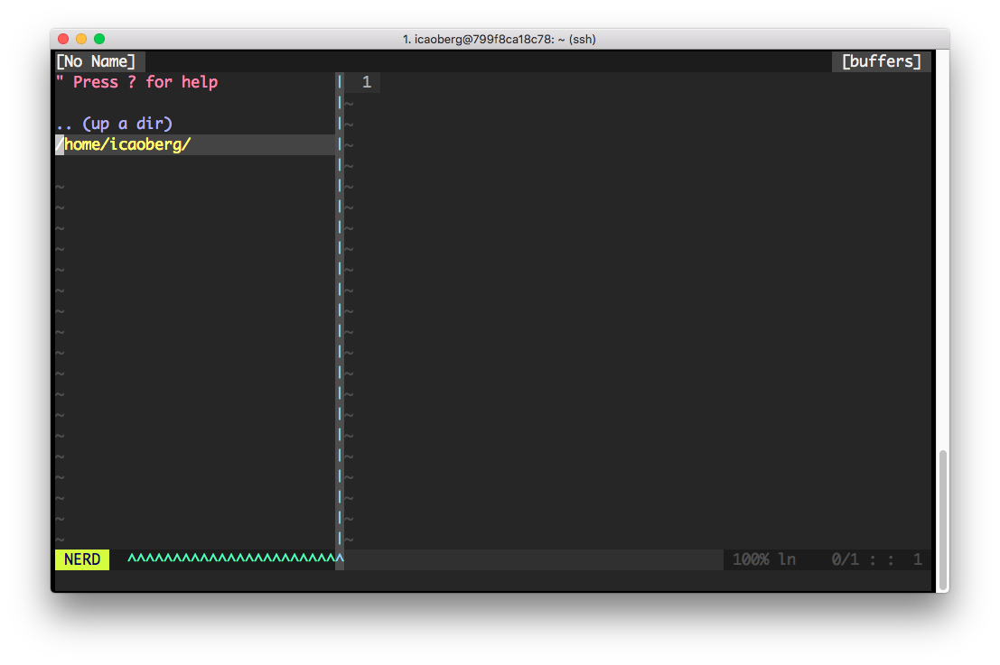

# docker-murphylab-python

[](https://travis-ci.org/icaoberg/docker-murphylab-python)
[](https://github.com/icaoberg/docker-murphylab-python/issues)
[](https://github.com/icaoberg/docker-murphylab-python/network)
[](https://github.com/icaoberg/docker-murphylab-python/stargazers)
[](https://www.gnu.org/licenses/quick-guide-gplv3.en.html)



This Dockerfile is used to build a [Singularity](http://singularity.lbl.gov/) container for members of the [Murphy Lab](http://murphylab.web.cmu.edu/) at the [Computational Biology Department](http://www.cbd.cmu.edu) at [Carnegie Mellon University](http://www.cmu.edu) for use in the department's HPC.

To build an image using the `Dockerfile` in this repository, run the command

```
➜ docker build -t "murphylab/python27" .
```

To run a container using the image above

```
➜  docker run -i -t "murphylab/python27"
```
